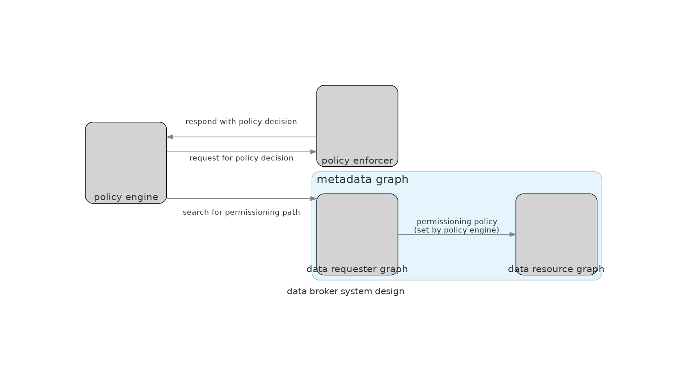

# Problem identification

The problem to be solved is creating an access control plane, or a broker, between a data resource requester, and a data resource owner.

This plane is efficient. We do _not_ want:

- A requester to have to wait for authorisation, when an individual's attributes (e.g. corporate position as vice-president) should have already granted him/her access to the data resource. Likewise, we do not want a data resource owner be unecessarily troubled with reviewing access.
- A requester to have inconsistent access rights based on the exploitation application he/she uses. E.g. Tableau manages user groups, which are different from Superset's.

# Conceptual model of the problem

There are two graphs to connect.

- Data resource graph.
  - Nodes: tables, or non-table data resources derived from tables (e.g. dashboards).
  - Edges: lineage between tables, or composition of dashboard from tables.
- Individual attributes graph.
  - Nodes: an individual (TODO: decide if this is just a requester or whether owner is part of it), designations and other attributes that a user may have in a certain context (e.g. corporate hierarchy).
  - Edges: relationships between individual and designations, or designations and designations.

The problem is about whether there is a path from XXX to XXX.

But first, these two graphs are not connected, and hence there is currently no path. The way to connect them is via a **Casbin policy object**. The tracing of a path is done via a **Casbin matcher**, and a **Casbin effect** returns a `true` only if there is an allow path, and there is no deny path.

## Elaboration on Casbin matcher

Matcher is like a reducer, taking in `r.obj` and `p.obj`. It reduces the object in question to its source. Then we check if the necessary policy applies.

What this means, is that policy only applies to the maximally reduced object. E.g. policy will not apply to a dashboard, since a dashboard is composed of tables.

### Column-level security

Two kinds of read permissions.

- read unmasked; and
- read masked.

### Row-level security

TODO

## Parsing of raw request

The raw request can be to query tables, e.g. via SQL.

TODO: User impersonation.

# Components

In this repo, the components are implemented as Docker containers. But you may wish to implement them using cloud-native tooling. That will simply require changing the config that specifies interfaces between the various components.

# Useful references

- OPA, as an alternative to Casbin, implements policy-as-SQL [link here](https://blog.openpolicyagent.org/write-policy-in-opa-enforce-policy-in-sql-d9d24db93bf4).